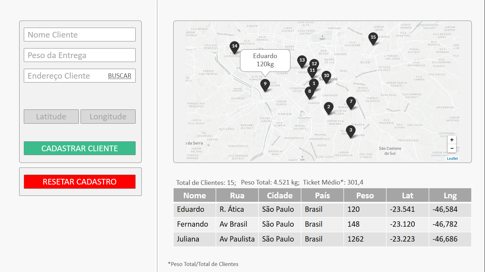

# Introdução

Olá! Obrigado pelo interesse em participar do nosso processo seletivo para dev fullstack na [Uhuu](https://uhuu.com/).

O objetivo do desafio proposto é permitir uma melhor avaliação das suas habilidades como candidato à vaga de fullstack. Este desafio deve ser feito apenas por você. Sua implementação e escolha de ferramentas poderá ser questionada em outra etapa.

Um layout final bem elaborado e desenhado aponta para um diferencial seu, mas não é necessário se preocupar muito com o design. Afinal, não estamos buscando um designer para essa vaga!

## O desafio

Ao finalizar o desafio, o usuário deverá estar habilitado a cadastrar os clientes no formulário, e ao salvar, atualizar o mapa com o ponto (pin) daquele cadastro e a tabela com os dados do cliente. Na tabela deverá conter um botão para excluir todos os dados, que deverá remover tudo do banco, mapa e tabela.

Para garantir um melhor desempenho, a tabela deverá ser paginada.

Siga o [layout abaixo](challenge.png) sugerido. Caso queira, ele pode ser melhorado de acordo com a sua preferência.

## Requisitos funcionais

* [ ] O usuário deve ter acesso a uma tabela com as entregas programadas

* [ ] O usuário deve conseguir paginar a tabela com os registros

* [ ] O usuário deve ter um botão para buscar os dados de latitude e longitude a partir do endereço (pode ser usado o [Google Geocode API](https://developers.google.com/maps/documentation/geocoding/intro?hl=pt-br) ou outro equivalente, como o [Nominatim](https://nominatim.org/))

* [ ] O usuário poderá cadastrar novos clientes na tabela de clientes

* [ ] O usuário deve ter um mapa com todas as entregas apontadas com pins

* [ ] O usuário deve ter um botão para resetar todos os cadastros

## Estrutura proposta dos campos 

A estrutura proposta para armazenar os dados é a seguinte:

1. Nome do cliente
2. Peso em kg
3. Endereço
    - Logradouro
    - Número
    - Bairro
    - Complemento
    - Cidade
    - Estado
    - País
    - Geolocalização
        - Latitude
        - Longitude

## Requisitos não funcionais

* [ ] O frontend deverá ser criado usando [React](https://reactjs.org/)

* [ ] O backend deverá ser criado utilizando node.js (você pode escolher qualquer framework javascript/typescript para construção do backend)

* [ ] Na raiz do projeto, será necessário incluir um arquivo `README.md` com as instruções para construir seu projeto localmente. Opcionalmente você pode detalhar as razões pelas escolhas de ferramentas e técnicas aplicadas ao desafio.

* [ ] O frontend deverá se comportar da mesma forma na última versão estável dos seguintes browsers: Chrome, Firefox, Edge

* [ ] O backend deverá rodar no docker (ou docker-compose)

* [ ] O backend deve possuir alguma documentação das api (swagger ou outra equivalente)

## Dicas e observações

> Obs 1.: Fique a vontade para utilizar qualquer 3rd party;

> Obs 2.: Considere que todos os campos são de preenchimento obrigatório no formulário.

> Obs 3.: Considere validar os campos também na API e em caso de inconsistência retornar erro num JSON estruturado com código HTTP 400

## Critérios de avaliação

- Boas práticas de desenvolvimento como: componentização, design patterns, clean code
- Domínio das ferramentas e linguagens que compõe um app de frontend e backend moderno
- Documentação: explicação para construir o app localmente, histórico e workflow de git

## Entrega

Para realizar a entrega do desafio, você deverá enviar para o recrutador o link para o repositório com seu código. Exemplo:

https://github.com/seu-nome/fullstack-challenge.git

Não se esqueça de criar um arquivo `README.md` contendo as instruções para construir o app localmente.

:bangbang: **Importante!** O repositório com seu código deve estar publico, para que possamos acessa-lo!

## Feedback

Na Uhuu, valorizamos muito o fator humano e feedbacks. Acreditamos que o feedback é essencial para melhorar, aprender e facilitar processos. Dessa forma, assim que o seu desafio for submetido, prometemos enviar um feedback técnico nos próximos dias usando todos os critérios de avaliação descritos acima.

## Dúvidas

Caso haja qualquer dúvida sobre o teste, entre em contato com o recrutador que nós responderemos o mais rápido possivel.

---
## Obrigado e bom desafio!